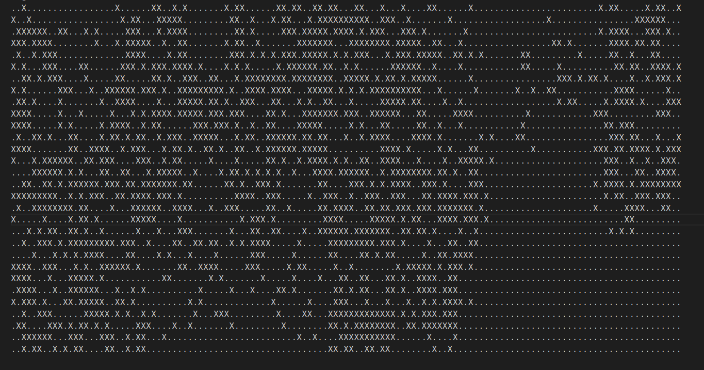
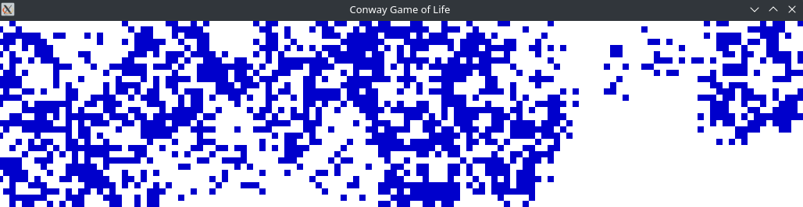
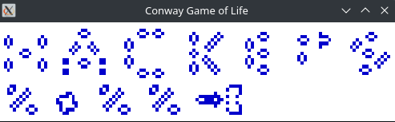

# Introduction

## First of all. Where is your input file?

The input file is `input.cog`

Which looks like this:



## Why is this pattern interesting?

NO SPOILERS! JUST RUN THE PROJECT AND YOU WILL SEE.

## OK OK. How do I run your project?

1. Open up a terminal and `cd` to the root of this repository
2. Widen your terminal (maximize it!).
3. Check that your terminal is big enough. You should be able to run `cat input.cog` without line wrapping.
4. Run the project in automatic mode:

```
> python3 game.py input.cog
```

5. Run the project in manual mode:
```
> python3 game.py -m manual input.cog
```

# Wait, what the hell, how did u... do that? HOW DOES THAT WORK? WHAT KIND OF BLACK MAGIC IS THIS?

Okay, calm down u crazy. I'll explain it to you.

My idea was to create something with the HACKEPS 2022 letters.

So, I said to myself,  LET'S FREAKING MAKE HACKEPS 2022 HAPPEN IN GAME OF LIFE!

So the first thing I did was try to create a stable verson of the letters. Here are some prototypes:


This was a VERY tedious and VERY LONG process. Here are some of the tools and websites I had to access to find still life patterns:

- https://playgameoflife.com/
- https://en.wikipedia.org/wiki/Still_life_(cellular_automaton)
- https://conwaylife.com/wiki/Still_life


Then I created the `merge_side.py` script that allowed me to merge all of the patters together. You can find more info in `Makefile`.

You can find the patters in `patterns/`. After merging them I ended up with `patters/hackeps`.

If all the individual patterns for the layers are stable, their concatenation (with enough spacing) is also stable! So the final pattern is stable! :)

# WAIT WAIT WAIT. YOU ARE AVOIDING THE QUESTION YOU CRAZY BASTARD! THE SOLUTION YOU HAVE PROVIDED LEADS TO THE FINAL PATTERN!!!! HOW DID YOU DO THAT??

Well. Magic. Also called SATisfiability solvers!

As you may know Game of Life is not reversible: https://en.wikipedia.org/wiki/Reversible_cellular_automaton#Critters

This means that while you can always move forwards, in game of life you cannot move backwards! For instance, imagine trying to move backwards from an empty board, the ammount of solutions is infinite! Even if the size of the board is fixed, moving backwards is exponentially complex.

However, with enough compute power, enough [scientific literature research](https://link.springer.com/chapter/10.1007/978-3-540-76928-6_63), the [right tools](https://github.com/flopp/gol-sat) and the right [SAT solver](https://github.com/conp-solutions/mergesat) you can make (almost) everything possible!

So what I did was reverse the pattern as much as possible without my computer exploding! And that's it!

# Please explain it to me like I am 5 years old

Gotcha. So the idea is:
- Make fancy stable characters (See `patterns`)
- Merge them so they make a fancy stable pattern (See `merge_side.py`, `Makefile` and `patterns/hackeps`) 
- The stable pattern gets codified into [Conjunctive Normal Form](https://en.wikipedia.org/wiki/Conjunctive_normal_form). You can find the codified problem in `problem.cnf`
- The problem gets solved with a SAT solver (example: `./mergesat-binary problem.cnf`)
- The solution gets reinterpreted as cells (each cell and each iteration gets mapped to a boolean variable) and made representable in `input.cog`

# What is that thing that moves? A ... butterfly? A Mosquitto? 

When this was done, I decided to get really fancy. So I added a fancy horizontal glider in the pattern!

The problem is, sliders usually go sideways! So I needed to do some research to found cool horizontal sliders.

Turns out there is a generalization of sliders called `Spaceshisps`: https://conwaylife.com/wiki/Spaceship

And a particular version of a spaceship, called `Schick engine` works perfectly in the remaining space of the pattern for HackEPS 2020: https://conwaylife.com/wiki/Schick_engine

In particular this small version works pretty well: https://catagolue.hatsya.com/object/xq12_fh1i0i1hfzw8sms8zxfjf/b3s23/

And yes, that shape is very similar to a .... P.... Pe.... perhaps it looks similar to Jeff Bezo's rocket?


# THIS IS CRAZYYYYYYYYYYYYY

BUT WAIT!!!

THERE IS MORE!!!

RUN THE FOLLOWING COMMANDS:

```
python3 -m venv venv
source venv/bin/activate
pip install -r requirements.txt
python3 game.py -m manual -v opengl input.cog
```



# WAIT WHAT???

I programmed Game of Life in OpenGL for fun. Yes. I did it. If you run it with `python3 game.py -m manual -v opengl input.cog` it will update on each keyboard press. if you run it without `-m manual` it will run automatically.



I hope you liked the project! :D

- Josep Maria Salvia Hornos