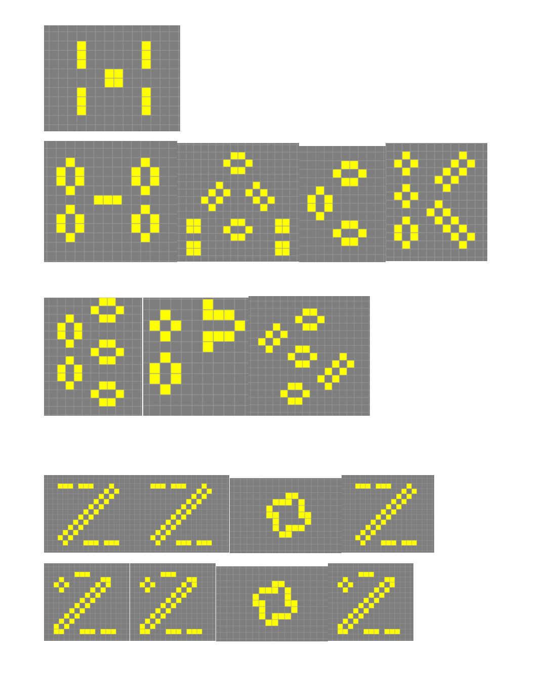

# Pattern

You can find the proposed pattern in backwards/hackeps_g_2

# Where did I find inspiration?

I mean.. It's clear, isn't it?

We are participating in the HACKEPS 2022!

SO LET'S FREAKING MAKE HACKEPS 2022 HAPPEN IN GAME OF LIFE!

# Wait, what the hell, how did u... do that? HOW DOES THAT WORK? WHAT KIND OF BLACK MAGIC IS THIS?

Okay, calm down u crazy. I'll explain it to you.

My idea was to create something with the HACKEPS 2022 letters.

So the first thing I did was try to create a stable verson of the letters. Here are some prototypes:

This was a VERY tedious and VERY LONG process. Here are some of the tools and websites I had to access to find still life patterns:

- https://playgameoflife.com/
- https://en.wikipedia.org/wiki/Still_life_(cellular_automaton)
- https://conwaylife.com/wiki/Still_life

Then I created the `merge_side.py` script that allowed me to merge all of the patters together.

You can find the patters in `patterns/`. After merging them I ended up with `patters/hackeps`.

If all the individual patterns for the layers are stable, their concatenation (with enough spacing) is also stable! So the final pattern is stable! :)

But wait! There is more! When this was done, I decided to get really fancy. So I added a fancy horizontal glider in the pattern!

The problem is, sliders go sideways! So I needed to do some research to found horizontal sliders.

Turns out there is a generalization of sliders called `Spaceshisps`: https://conwaylife.com/wiki/Spaceship

And a particular version of a spaceship, called `Schick engine` works perfectly in the remaining space of the pattern for HackEPS 2020: https://conwaylife.com/wiki/Schick_engine

In particular this small version works pretty well: https://catagolue.hatsya.com/object/xq12_fh1i0i1hfzw8sms8zxfjf/b3s23/

# WAIT WAIT WAIT. YOU ARE AVOIDING THE QUESTION YOU CRAZY BASTARD! THE SOLUTION YOU HAVE PROVIDED LEADS TO THE FINAL PATTERN AND NOT THE OTHER WAY AROUND!!!! HOW DID YOU DO THAT??

Well. Magic. Also called SATisfiability engines!

As you may know Game of Life is not reversible: https://en.wikipedia.org/wiki/Reversible_cellular_automaton#Critters

This means that while you can always move forwards, you may not always move backwards! There are states from which you cannot move backwards (it's impossible). 

Moreover, one of the most common situtations is that the number of states to move backwards is VERY big (exponentially so).

However, with enough compute power, enough [literature research](https://link.springer.com/chapter/10.1007/978-3-540-76928-6_63), the [right tools](https://github.com/flopp/gol-sat) and the right [SAT solver](https://github.com/conp-solutions/mergesat) you can make everything possible!

So what I did was reverse the pattern as much as possible without my computer exploding with a timelimit of an hour! And that's it!

I hope you like it! :D

- Josep Maria Salvia Hornos